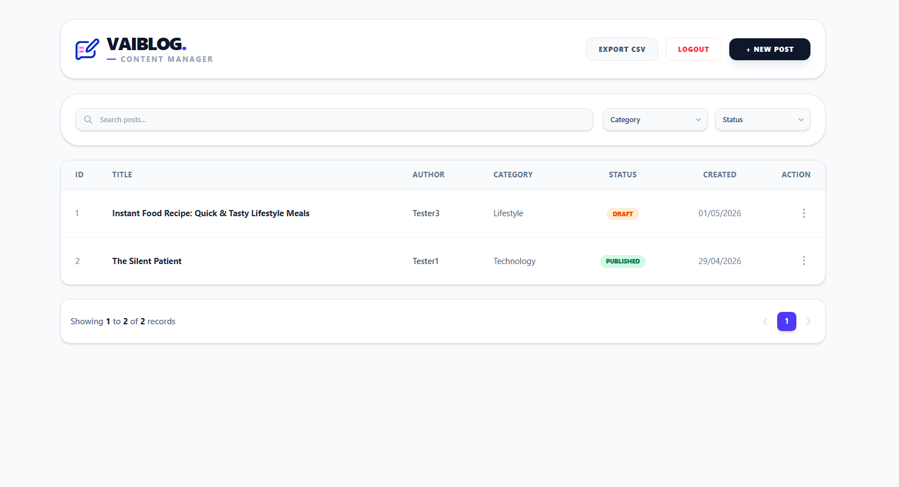
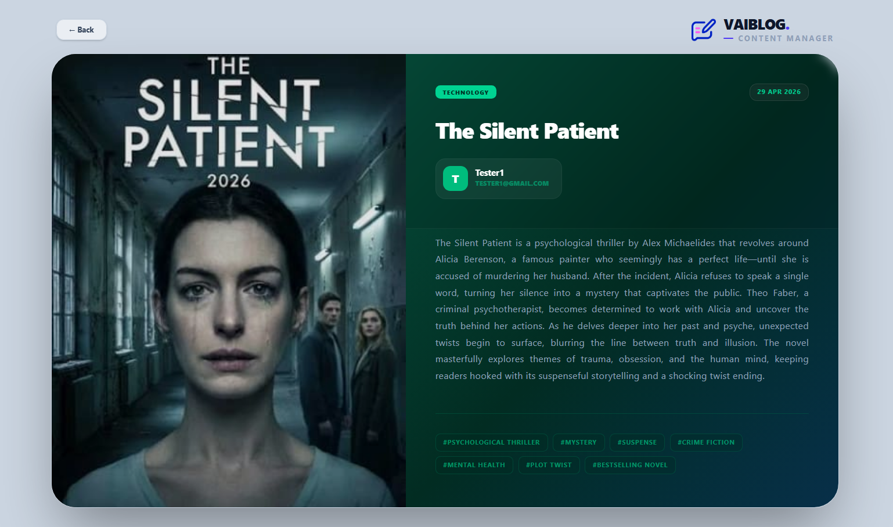
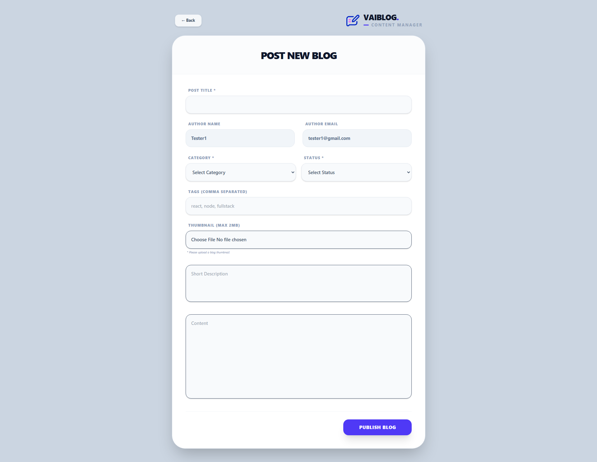
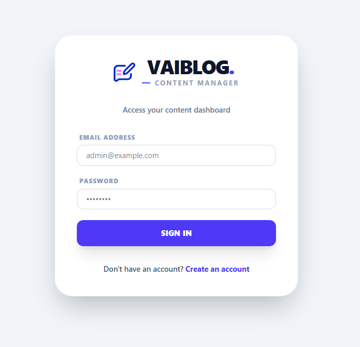
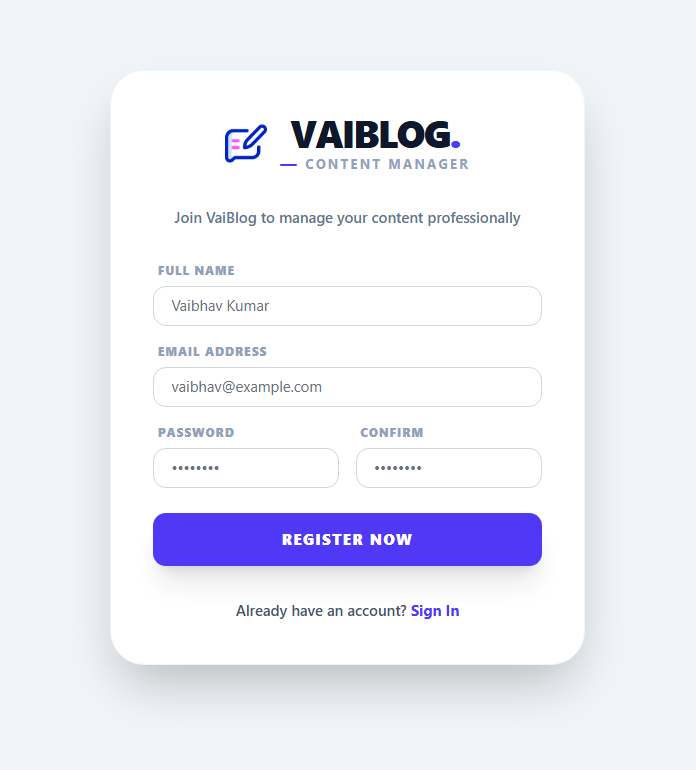

# VaiBlog Manager 🚀

A Professional Full-Stack Blog Management System built for early-career professionals and developers, focusing on modern web standards and a scalable MERN stack architecture.

---

## ✨ Overview

VaiBlog Manager is a robust Content Management System (CMS) designed for professionally managing digital content. This application is built with early-career professionals and developers in mind, adhering to modern web standards and a scalable architecture.

---

## 🚀 Live Demo

- **Frontend (Netlify):** [https://vaiblog-manager.netlify.app](https://vaiblog-manager.netlify.app)
- **Backend (Render):** [https://blog-post-management-system-1gtn.onrender.com](https://blog-post-management-system-1gtn.onrender.com)

<p align="left">
  <a href="https://www.netlify.com" target="_blank">
    
  </a>
  <a href="https://render.com" target="_blank">
    
  </a>
</p>

---

## �️ Tech Stack

### Frontend (User Interface)

<p align="left">
  
  
  
  
  
  
</p>

- **React.js**: Used functional components and custom hooks to build a dynamic and fast Single Page Application (SPA).
- **Tailwind CSS**: Utilized a modern utility-first CSS framework to achieve a premium "SaaS" look-and-feel.
- **Formik & Yup**: Used for handling complex forms (like Blog creation/Authentication) and schema-based validation.
- **Axios**: Used for centralized API configuration and handling requests/responses.
- **React Router Dom**: For managing navigation and protected routes within the application.

### Backend (The Engine)

<p align="left">
  
  
  
  
  
  
</p>

- **Node.js & Express.js**: Used to build the RESTful API architecture.
- **MongoDB & Mongoose**: For flexible NoSQL database modeling and handling complex queries.
- **JWT (JSON Web Tokens)**: For stateless authentication and secure route authorization.
- **Multer**: For handling multipart/form-data and uploading blog thumbnails (images).

---

## 🔥 Key Technical Implementation

- **Custom Branding Engine**: Developed a modular `Logo` component to maintain brand consistency throughout the app.
- **Advanced Authorization Logic**: Implemented ownership verification logic in the backend to ensure only authorized users can modify/delete their own blogs (Resolved 403 Forbidden issues).
- **Data Export Logic**: Integrated an `Export to CSV` feature for professional storage of user's content, handled using Blob.
- **Smart Validation**: Fixed the validation logic in the thumbnail upload process to handle conflicts between existing images and new file uploads.
- **Optimized Rendering**: Optimized the `ViewBlog` component with a responsive grid system, especially for users on widescreen (web view) displays.

---

## 🏗️ Features Overview

- **Authentication**: Secure Sign-in and Sign-up flows.
- **Dashboard**: A centralized hub to manage all posts.
- **CRUD Operations**: Full Create, Read, Update, and Delete (CRUD) functionality with status management (Draft/Published).
- **Categorization**: Ability to organize blogs based on categories and tags.
- **Responsive Design**: Mobile-first approach with a desktop-optimized view.

---

## � Project Structure

The project is organized into two main folders: `Backend` and `Frontend`.

```
.
├── Backend/
│   ├── config/
│   │   └── db.js           # MongoDB connection setup
│   ├── controllers/
│   │   ├── authController.js # Logic for user registration & login
│   │   └── blogController.js # CRUD logic for blogs, including CSV export
│   ├── middlewares/
│   │   └── authMiddleware.js # JWT verification for protected routes
│   ├── models/
│   │   ├── blogModel.js      # Mongoose schema for Blogs
│   │   └── userModel.js      # Mongoose schema for Users
│   ├── routes/
│   │   ├── authRoutes.js     # API routes for /api/v1/auth
│   │   └── blogRoutes.js     # API routes for /api/v1/blog
│   ├── .env.example        # Environment variable template
│   ├── package.json
│   └── server.js           # Express server entry point
│
└── Frontend/
    ├── src/
    │   ├── api/
    │   │   └── axiosInstance.js # Centralized Axios config with interceptors
    │   ├── components/          # Reusable React components (Header, Table, etc.)
    │   ├── hooks/
    │   │   └── useBlogs.js      # Custom hook for fetching blog data
    │   ├── pages/               # Page-level components (Dashboard, Login, etc.)
    │   ├── App.jsx              # Main component with React Router setup
    │   └── main.jsx             # React application entry point
    ├── .env.example           # Environment variable template for VITE_API_URL
    ├── index.html
    └── package.json
```

---

## 📸 Screenshots

### 1. Centralized Dashboard

Manage all your posts from a single, intuitive dashboard with filtering, sorting, and pagination.



### 2. Rich Blog View

A premium, reader-friendly layout for viewing articles, optimized for widescreen displays.



### 3. Powerful Blog Editor

Create and edit posts using a clean form with rich text capabilities and smart validation.



### 4. Secure Authentication

A professional and secure sign-in/sign-up flow to protect user accounts.





---

## 🚀 Installation & Setup

### 1. Clone the Repository

```bash
git clone https://github.com/vaibhav-kumar/VaiBlog-Manager.git
cd VaiBlog-Manager
```

### 2. Backend Setup

```bash
cd Backend
npm install

# Create a .env file in the Backend directory.
# You can copy .env.example and fill in your details.
# PORT=8000
# MONGO_URI=<your_mongodb_connection_string>
# JWT_SECRET=<your_super_secret_jwt_key>

npm start
```

### 3. Frontend Setup

```bash
cd Frontend
npm install

# Create a .env file in the Frontend directory.
# You can copy .env.example.
# VITE_API_URL=http://localhost:8000/api/v1

npm run dev
```

---

## 👨‍💻 Developed By

**Vaibhav Kumar**  
_Software Developer | Full-Stack Enthusiast_

---
